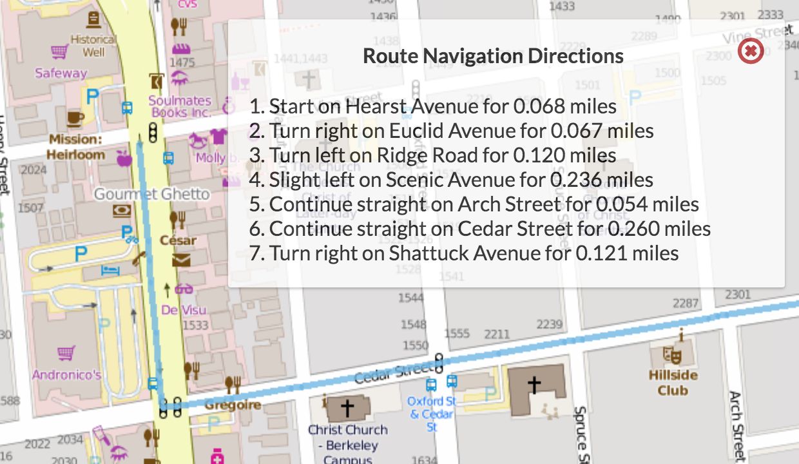
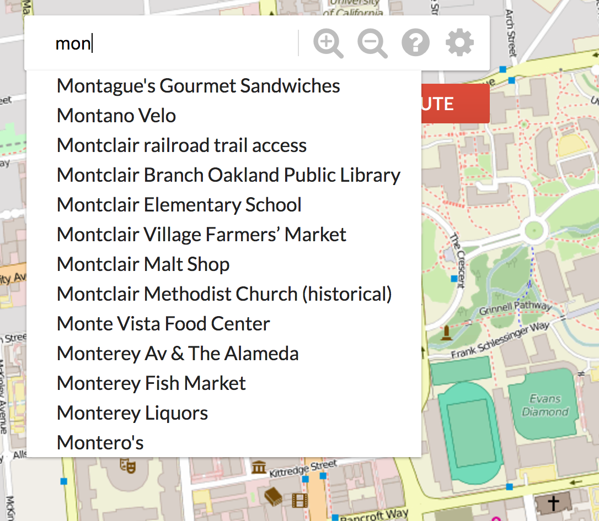

# bear-maps

## Technologies

* Java
* Apache Maven

## Shortest Route Finding

Implemented shortest route pathfinding using A* Search with Manhattan distance and nodes traversed as f-score.

## Search Autocomplete

Implemented search autocomplete feature using a trie which renders all possible paths upon user typing query.

