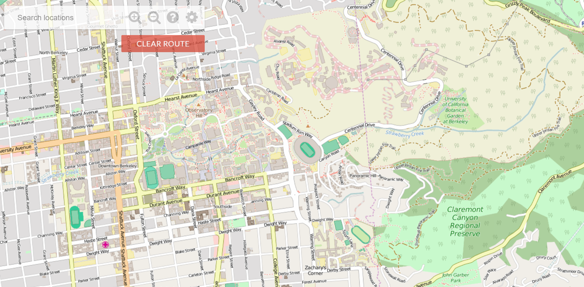

# bear-maps



## Technologies

* Java
* Apache Maven

## Map Rastering

Upon a user zooming in and out of the map, I reacquired the user's longitude and lattitude parameters, and then recalled my raster() function as follows: 

1.  If the QuadTreeNodes meet the specified resolution requirement, given by how much the user zooms in or out, then add nodes to rasterList
2.  Else, call raster on the nodes children, which breaks down the node into four daughter nodes, each of higher resolution.

```
public void raster(QuadTreeNode r, double ullon, double ullat, double lrlon, double lrlat) {
    if (r.intersects(ullon, ullat, lrlon, lrlat)) {
        if (r.getresolution() <= resolutionRequirement) {
            rasterList.add(r);
        } else if (r.nameLength() < 7) {
            if (r.getHasDaughters()) {
                raster(r.getUpperLeft(), ullon, ullat, lrlon, lrlat);
                raster(r.getUpperRight(), ullon, ullat, lrlon, lrlat);
                raster(r.getLowerLeft(), ullon, ullat, lrlon, lrlat);
                raster(r.getLowerRight(), ullon, ullat, lrlon, lrlat);
            } else {
                r.split();
                raster(r.getUpperLeft(), ullon, ullat, lrlon, lrlat);
                raster(r.getUpperRight(), ullon, ullat, lrlon, lrlat);
                raster(r.getLowerLeft(), ullon, ullat, lrlon, lrlat);
                raster(r.getLowerRight(), ullon, ullat, lrlon, lrlat);
            }
        } else {
            rasterList.add(r);
        }
    }
}
```

## Shortest Route Finding

Implemented shortest route pathfinding using A* Search with Manhattan distance and node distance to calculate the f-score. Upon finding the shortest path to the specified node, draw lines upon map of vectors from node to node.


```
while (fringe.size() != 0) {
    GraphNode temp = fringe.poll();
    if (temp.nodeEquals(endVertex)) {
        break;
    } else if (visited.contains(temp)) {
        continue;
    } else {
        visited.add(temp);
    }
    for (int i = 0; i < temp.getAdjacents().size(); i++) {
        current = temp.getAdjacents().get(i);
        if (visited.contains(current)) {
            continue;
        }
        if (!fringe.contains(current)) {
            current.setDistanceFromStart(temp.getDistanceFromStart()
                    + temp.findDistance(current), temp);
            fringe.add(current);
            currentPredecessors.add(current);
        } else if (temp.getDistanceFromStart() + temp.findDistance(current)
                < current.getDistanceFromStart()) {
            current.setDistanceFromStart(temp.getDistanceFromStart()
                    + temp.findDistance(current), temp);
            currentPredecessors.add(current);
        }
    }
}

```

## Search Autocomplete

Implemented search autocomplete feature using a trie which renders all possible paths upon user typing query.


```
private List<String> lookupChildrenHelper(String location, TrieNode node, int n){
    if (n == location.length()){
        return node.getChildren();
    } else if (!node.map.containsKey(location.charAt(n))){
        return null;
    } else {
        return lookupChildrenHelper(location, node.map.get(location.charAt(n)), n+1);
    }
}
```
